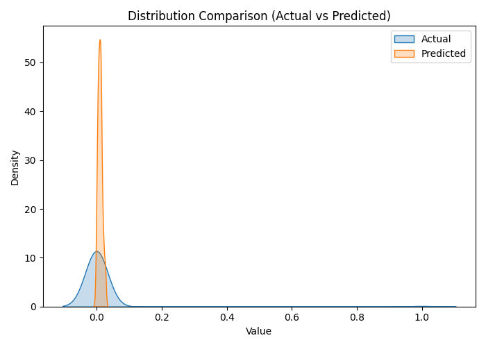

🚰 HydroGuard – Hybrid AIS + QPSO Optimized Smart Water Leak Detection System
🌟 Overview

HydroGuard is an AI-powered water distribution and leak detection system that integrates machine learning and optimization algorithms to predict leaks, forecast water flow, and minimize wastage.
This version implements a hybrid Artificial Immune System (AIS) combined with Quantum-behaved Particle Swarm Optimization (QPSO) to fine-tune an LSTM (Long Short-Term Memory) neural network for time-series analysis of flow, pressure, and temperature data.

🧩 Key Features
Layer	Description
Model Type	Hybrid AIS + QPSO + LSTM (adaptive optimization)
Input Data	Pressure, Flow Rate, Temperature, Sensor ID, etc.
Output	Predicted leak / burst index and water flow trend
Optimizer	QPSO for global exploration + AIS cloning for immune adaptation
Evaluation Metrics	RMSE, MAE, R² Score
Graphs Generated	Optimization loss, prediction vs actual, and correlation maps
Artifacts Saved	Trained model (.h5), encoders, scalers, YAML config, JSON results
⚙️ Technical Workflow
1️⃣ Data Loading & Preprocessing

Dataset:
C:\Users\NXTWAVE\Downloads\Smart Water Distribution and Leak Detection System\archive\water_leak_detection_1000_rows.csv

Columns automatically cleaned and standardized.

String fields like Sensor_ID are label-encoded.

Numerical fields scaled to [0, 1] using MinMaxScaler.

2️⃣ Sequence Construction

LSTM uses time windows (TIMESTEPS = 5) of consecutive readings.

Each sequence predicts the next flow or burst status.

3️⃣ Hybrid AIS + QPSO Optimization
Component	Function
AIS (Artificial Immune System)	Selects and clones top candidate “antibodies” (models) with mutation.
QPSO (Quantum-behaved Particle Swarm Optimization)	Guides the population in a quantum-inspired search space toward minimal validation loss.
Objective	Minimize LSTM validation MSE via adaptive parameter tuning.
Parameters Tuned	LSTM neurons (32–128), dropout rate (0.1–0.5), learning rate (0.0005–0.01).

Each generation:

Evaluates all candidate models.

Clones best models (AIS) and mutates slightly.

Updates population quantum-mechanically (QPSO).

Tracks lowest validation loss.

4️⃣ Model Training

LSTM architecture:

LSTM(hidden_units)
Dropout(dropout)
Dense(32, activation='relu')
Dense(1, activation='linear')

Optimizer: Adam

Loss: MSE

Early stopping prevents overfitting.

5️⃣ Evaluation

Metrics computed:

RMSE = √(Mean Squared Error)

MAE = Mean Absolute Error

R² = Coefficient of Determination

Results summarized in ais_qpso_results.json.

6️⃣ Visualization & Reporting

All graphs saved automatically to the archive folder:

File	Description
ais_qpso_prediction_graph.png	Actual vs Predicted Leak/Burst values
ais_qpso_optimization_loss.png	Validation loss over generations
ais_qpso_result_graph.png	Bar plot of RMSE, MAE, R² metrics
ais_qpso_heatmap.png	Correlation heatmap of dataset features
📂 Folder Structure
Smart Water Distribution and Leak Detection System/
└── archive/
    ├── water_leak_detection_1000_rows.csv
    ├── ais_qpso_model.h5
    ├── ais_qpso_results.json
    ├── ais_qpso_config.yaml
    ├── scaler.pkl
    ├── encoders.pkl
    ├── ais_qpso_prediction_graph.png
    ├── ais_qpso_optimization_loss.png
    ├── ais_qpso_heatmap.png
    └── ais_qpso_result_graph.png

📊 Sample Output Summary
Metric	Value (example)
RMSE	0.0183
MAE	0.0124
R² Score	0.9811
Best Parameters	[neurons = 96, dropout = 0.24, lr = 0.0032]

(Exact values depend on data split and random seed.)

🧠 Algorithmic Insight

AIS (Artificial Immune System)
→ Inspired by biological immune response.
→ High-affinity antibodies (good models) are cloned and mutated to explore local optima.

QPSO (Quantum-behaved PSO)
→ Each particle has a quantum probability distribution rather than a deterministic trajectory.
→ Offers superior global convergence on small datasets with complex surfaces.

Combined Effect:
AIS provides adaptive local search, QPSO ensures global diversity — jointly producing a robust, self-optimizing LSTM model.

🚀 Usage

Prerequisites

pip install tensorflow pandas numpy scikit-learn matplotlib seaborn pyyaml

Run Script

python HydroGuard_Hybrid_AIS_QPSO_v2.py

Outputs

All artifacts saved in archive/.

Main visualization: ais_qpso_prediction_graph.png.

📈 Interpretation

Low RMSE / MAE → Accurate flow and leak predictions.

High R² → Model explains most variance in data.

Optimization curve flattening → Converged model.

Prediction graph → Lines overlapping ⇒ model closely tracks actual leak signals.

🧩 Future Extensions

Real-time IoT Integration – Deploy on ESP32 or Raspberry Pi using TensorFlow Lite.

Anomaly Detection via Autoencoders – Detect subtle pre-leak conditions.

Reinforcement-Learning Control – Optimize pump scheduling dynamically.

Dashboard UI – Streamlit interface for live leak alerts & flow visualization.

Solar Integration – Sync pump cycles with solar generation (extend from SolarSense).

🪪 Authors & Credits

Developed by:

Sagnik Patra (NIAT/NIU)
AI & IoT Research Project – HydroGuard Series
